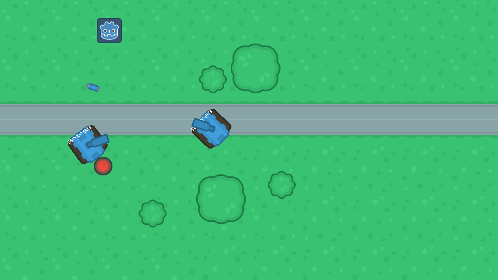

# BoomTanks
BoomTanks is multiplayer top-down shooter game. 

Its in early stage of development, but basic gameplay works.

## How To play?
0. If you have exported game, skip to step 3.
1. Download GodotEngine from https://godotengine.org/download/ and unpack to root of game directory.
2. Launch game using Godot Engine executable.
3. Put IP and click host, or if you are player put ip of the server then click join.
4. When All players are in lobby, click start.
5. Enjoy the game! (If its possible in current stage :D)

### Credits
Thanks to Kenney from https://kenney.nl/ for awesome art available under CC0 license!
